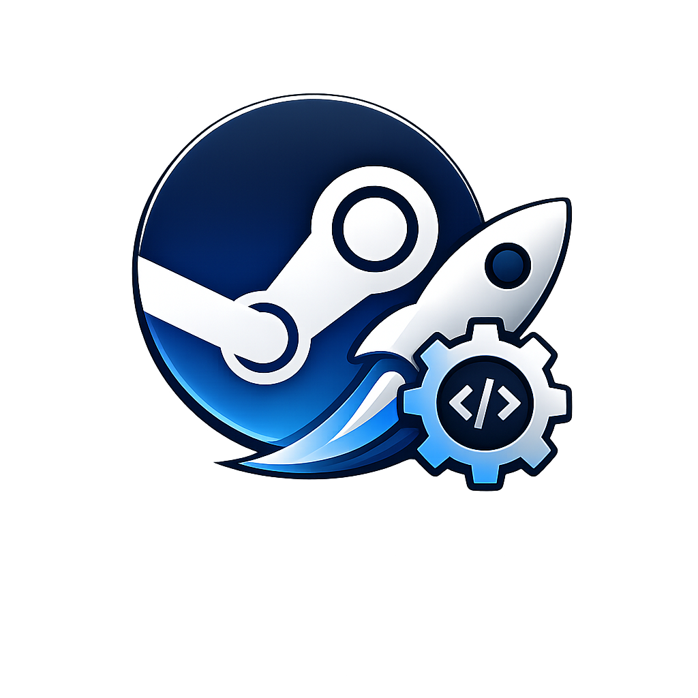
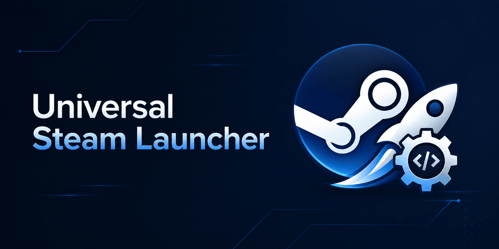
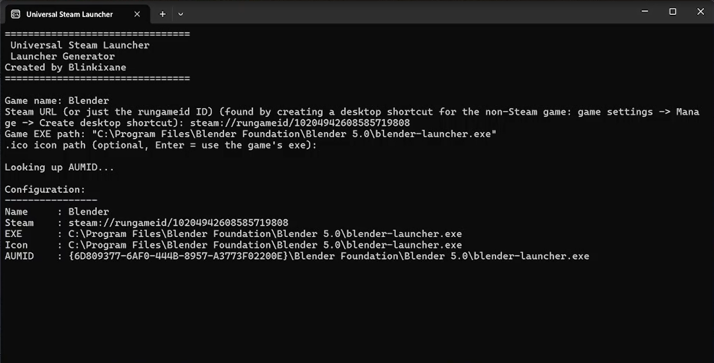
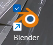
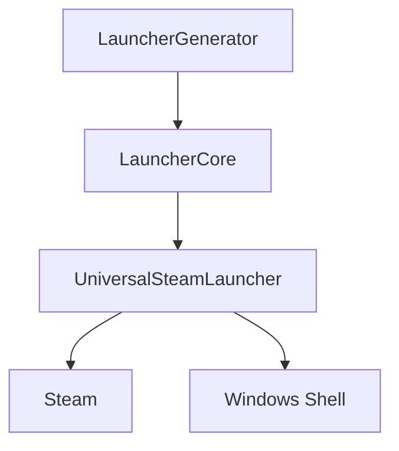

<p align="center">
  
</p>

<h1 align="center">Universal Steam Launcher</h1>

<p align="center">
Create Windows launchers for any application or game and run them through Steam with proper taskbar integration.
</p>

<p align="center">


</p>
<p align="center">
  
</p>

Universal Steam Launcher allows you to create custom launchers for any Windows executable (.exe) and start them through Steam.

Unlike traditional shortcuts or previous launcher solutions, generated launchers use proper Windows AppUserModelID (AUMID) integration, preventing duplicate taskbar icons and providing a native Windows application experience.

Features include:
- Custom icons
- Start Menu and desktop shortcuts
- Taskbar grouping
- Steam URI support
- AUMID-based Windows integration
## Screenshots

<p align="center">
  
</p>

<p align="center">
Launcher Generator
</p>


<p align="center">
  
</p>

<p align="center">
Generated launcher integration
</p>

## The story of the project

This project started from a simple issue:

I wanted to launch non-Steam applications and games through Steam while keeping a proper Windows experience.

Traditional Steam shortcuts or custom launchers often have Windows integration problems:

- Duplicate taskbar icons when an application is pinned
- Incorrect taskbar grouping
- Missing or incorrect application icons
- Shortcuts that do not behave like native Windows applications

Existing solutions could launch the application, but they did not properly handle Windows AppUserModelID (AUMID) integration.

Universal Steam Launcher was created to solve this problem by generating dedicated launchers that behave like native Windows applications while still launching any `.exe` through Steam.

## Features

* Steam game launcher generation
* Windows AppUserModelID (AUMID) support
* Custom icon support
* Native Windows taskbar integration
* Automatic launcher generation
* Self-contained Windows executables
* Built-in launcher generator tool
* Multi-language support (currently French and English)

## Components

### UniversalSteamLauncher

Main launcher application.

Responsible for:

* Starting applications
* Managing Windows integration
* Applying AUMID runtime configuration

### LauncherGenerator

Tool used to create custom launchers.

Features:

* Game/application configuration
* Steam URI support
* Icon selection
* Launcher creation

### LauncherCore

Core library containing:

* AUMID handling
* Window detection
* Shortcut management

### LauncherShared

Shared components:

* Configuration models
* Localization
* Common utilities

### Development Tools

Utilities used during development:

* AumidDiag
* AumidWatcher

Used to analyze and debug Windows AUMID behavior.
## Tools

### Get-Aumid.ps1

A PowerShell utility to retrieve the AppUserModelID (AUMID) of installed Windows applications.

Usage:

powershell :  .\Tools\Get-Aumid.ps1

## Installation

1. Download the latest release.
2. Run **UniversalSteamLauncherSetup.exe**.
3. Follow the installation wizard.
4. Launch Universal Steam Launcher.
## Build

### Requirements

* Windows 10/11
* .NET 8 SDK
* Visual Studio 2022 or compatible IDE
* Inno Setup (for installer creation)

Clone the repository:

```bash
git clone https://github.com/Blinkixane/UniversalSteamLauncher.git
```

Build the release:

```powershell
.\Installer\build-release.ps1
```

The compiled files will be available in:

```text
dist/
```
## Support

If you enjoy Universal Steam Launcher and want to support future development, you can support the project here:

Coming soon ☕ (in the next months)


## Architecture


This project is licensed under the MIT License.
